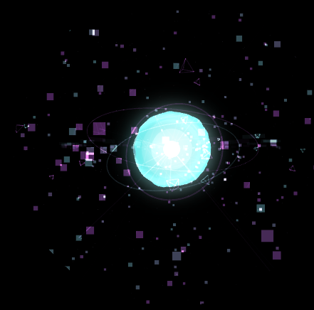
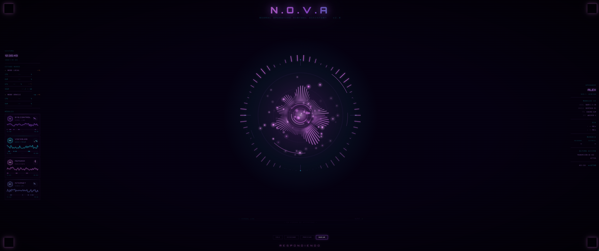
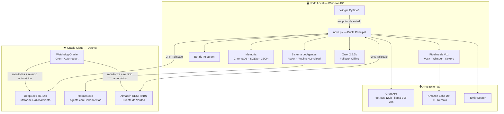

# N.O.V.A. — Asistente Virtual Operativo Neural

Asistente de IA personal distribuido en dos nodos (PC local + Oracle Cloud), con enrutamiento adaptativo de LLMs, memoria semántica persistente, interfaz de voz y un sistema de agentes autoextensible.

 

---

## ¿Qué hace a NOVA diferente?

**Funciona sobre infraestructura de coste cero.** Los modelos pesados (DeepSeek-R1:14b, Hermes3:8b) corren en Oracle Cloud Always Free. El nodo local gestiona voz e interfaz gráfica. Sin facturas de API para inferencia.

**Memoria que realmente persiste.** Arquitectura de cuatro capas: JSON comprimido para inyección de contexto rápida, ChromaDB para búsqueda semántica, SQLite como historial completo, y un almacén REST en Oracle como fuente de verdad distribuida — sincronizado entre nodos, sesiones e interfaces (voz, Telegram, widget).

**Se extiende sola en tiempo de ejecución.** Cuando una petición cae fuera de las capacidades conocidas, NOVA genera un snippet Python vía LLM, pide confirmación, lo ejecuta en un subproceso controlado y lo cachea permanentemente. La siguiente vez que se necesite esa capacidad, no hay paso de generación.

**Dos nodos, red privada, sin endpoints públicos.** El PC local y Oracle Cloud se comunican exclusivamente a través de la VPN mesh de Tailscale. La API de LLM y la sincronización de memoria nunca pasan por internet público.

---

## Arquitectura



**Enrutamiento:** clasificación por palabras clave en tiempo de ejecución → DeepSeek-R1 para razonamiento y código, Groq para respuestas conversacionales rápidas, Qwen2.5 como fallback offline. Automático y consciente de la latencia.

---

## Stack tecnológico

| Tecnología | Rol |
|---|---|
| Python 3.11 | Runtime principal |
| Ollama | Servicio de LLMs (local + Oracle) |
| DeepSeek-R1:14b | Razonamiento en cadena (Oracle) |
| Hermes3:8b | Agente ReAct con herramientas (Oracle) |
| Qwen2.5:3b | Fallback offline rápido (local) |
| Groq API | Inferencia en la nube (gpt-oss-120b / llama-3.3-70b) |
| ChromaDB | Memoria vectorial semántica |
| SQLite | Historial completo de conversaciones |
| PySide6 + QWebEngineView | Widget de escritorio sin marco (orbe WebGL) |
| Vosk | Detección de palabra de activación offline en español |
| faster-Whisper large-v3-turbo | Reconocimiento de voz con CUDA |
| Kokoro / Edge TTS / Alexa Remote | Pipeline TTS con fallback por capas |
| Tailscale | VPN mesh entre nodos |
| python-telegram-bot | Interfaz de Telegram |
| Tavily | Búsqueda web en tiempo real |

---

## Inicio rápido

```bash
git clone https://github.com/alopezch6/N.O.V.A.-Neural-Operative-Virtual-Assistant.git
cd N.O.V.A.-Neural-Operative-Virtual-Assistant
pip install -r requirements.txt
cp .env.example .env
# Rellena tus claves — ver .env.example como referencia
python nova.py
```

> El pipeline de voz requiere una GPU con CUDA y micrófono.
> El nodo Oracle requiere Ollama con `deepseek-r1:14b` y `hermes3:8b` descargados.
> Ambos nodos deben estar en la misma red Tailscale.

---

## Documentación

| Doc | Contenido |
|---|---|
| [Arquitectura](docs/architecture.md) | Desglose de módulos, decisiones de diseño, estructura del proyecto |
| [Sistema de Memoria](docs/memory-system.md) | Arquitectura de cuatro capas explicada |
| [Pipeline de Voz](docs/voice-pipeline.md) | Palabra de activación → STT → TTS |
| [Infraestructura](docs/infrastructure.md) | Nodo Oracle, Tailscale, watchdogs, configuración systemd |

---

## Licencia

MIT
