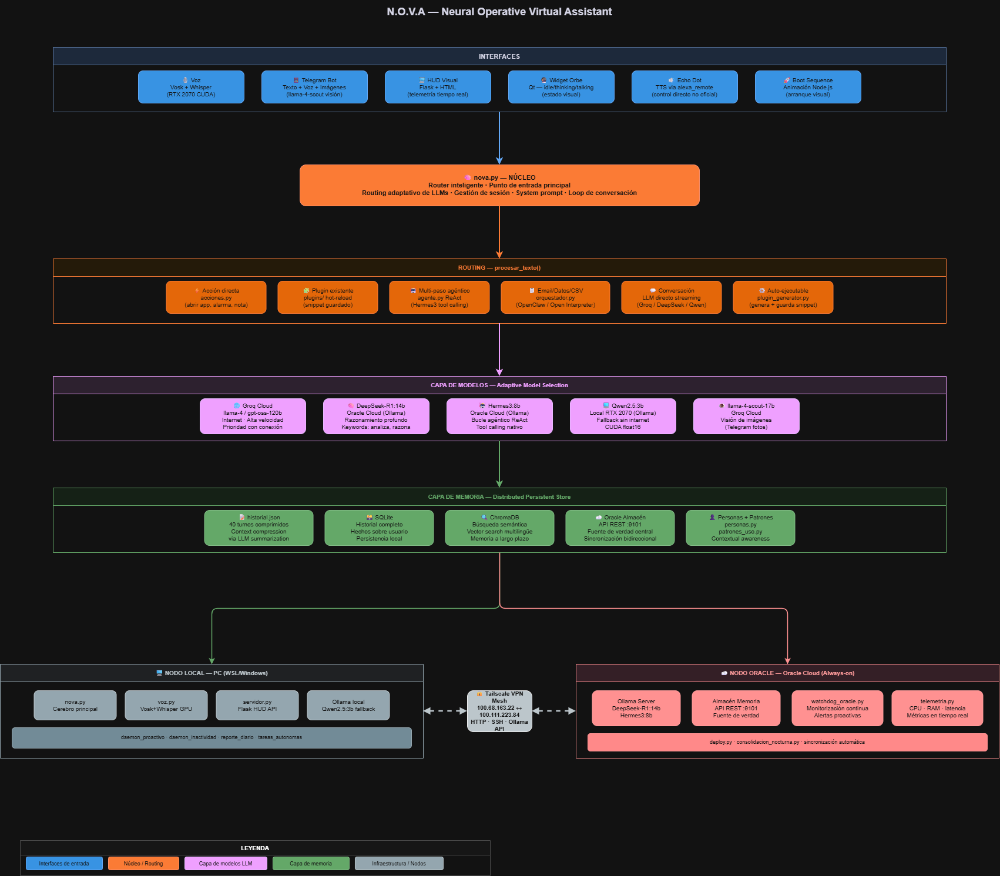

# NOVA — Neural Operative Virtual Assistant

A distributed personal AI assistant running across two nodes (local PC + Oracle Cloud), with adaptive LLM routing, persistent semantic memory, voice interface, and a self-extending agent system.

 

---

## What makes NOVA different?

**It runs on zero-cost infrastructure.** Heavy models (DeepSeek-R1:14b, Hermes3:8b) run on Oracle Cloud Always Free. The local node handles voice and UI. No ongoing API bills for inference.

**Memory that actually persists.** Four-layer memory architecture: compressed JSON for fast context injection, ChromaDB for semantic search, SQLite for full history, and an Oracle REST almacén as the distributed source of truth — synced across nodes, sessions, and interfaces (voice, Telegram, widget).

**It extends itself at runtime.** When a request falls outside known capabilities, NOVA generates a Python snippet via LLM, asks for confirmation, executes it in a sandboxed subprocess, and caches it permanently. The next time the same capability is needed, no generation step occurs.

**Two nodes, private network, no public endpoints.** Local PC and Oracle Cloud communicate exclusively over Tailscale mesh VPN. The LLM API and memory sync never touch the public internet.

---

## Architecture



**Routing:** keyword classification at runtime → DeepSeek-R1 for reasoning/code, Groq for fast conversational responses, Qwen2.5 as offline fallback. Automatic, latency-aware, no manual switching.

---

## Tech Stack

| Technology | Role |
|---|---|
| Python 3.11 | Core runtime |
| Ollama | LLM serving (local + Oracle) |
| DeepSeek-R1:14b | Chain-of-thought reasoning (Oracle) |
| Hermes3:8b | ReAct tool-calling agent (Oracle) |
| Qwen2.5:3b | Fast offline fallback (local) |
| Groq API | Cloud inference (gpt-oss-120b / llama-3.3-70b) |
| ChromaDB | Semantic vector memory |
| SQLite | Full conversation history |
| PySide6 + QWebEngineView | Frameless desktop widget (WebGL orb) |
| Vosk | Offline Spanish wake-word detection |
| faster-Whisper large-v3-turbo | CUDA speech recognition |
| Kokoro / Edge TTS / Alexa Remote | TTS pipeline with layered fallback |
| Tailscale | Mesh VPN between nodes |
| python-telegram-bot | Telegram interface |
| Tavily | Real-time web search |

---

## Quick Start

```bash
git clone https://github.com/your-username/nova.git
cd nova
pip install -r requirements.txt
cp .env.example .env
# Fill in your keys — see .env.example for reference
python nova.py
```

> Voice pipeline requires a CUDA-capable GPU and a working microphone.
> Oracle node requires Ollama with `deepseek-r1:14b` and `hermes3:8b` pulled.
> Both nodes must be on the same Tailscale network.

---

## Documentation

| Doc | Contents |
|---|---|
| [Architecture](docs/architecture.md) | Module breakdown, design decisions, project structure |
| [Memory System](docs/memory-system.md) | Four-layer memory architecture explained |
| [Voice Pipeline](docs/voice-pipeline.md) | Wake word → STT → TTS chain |
| [Infrastructure](docs/infrastructure.md) | Oracle node, Tailscale, watchdogs, systemd setup |

---

## License

MIT
